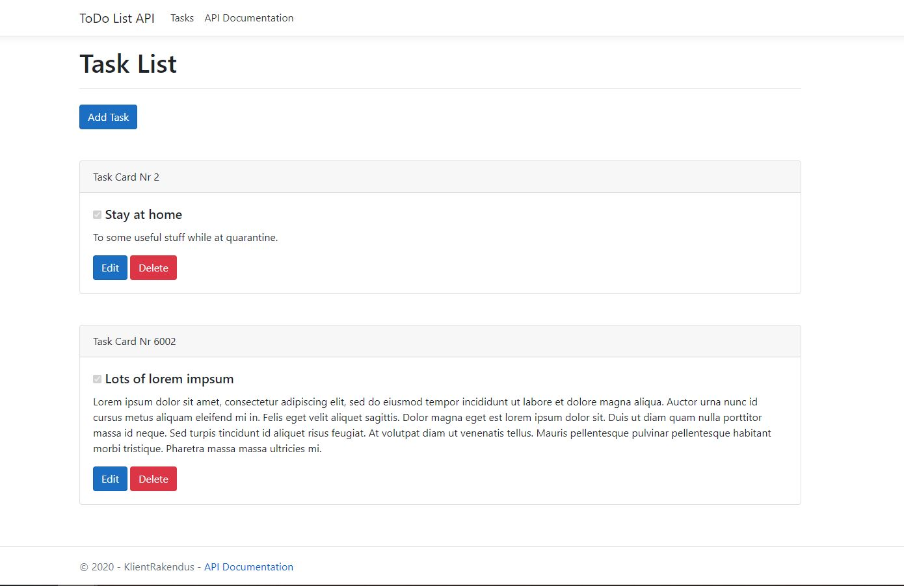

# ToDo-List API
Task List API made with MVC design-pattern via ASP.NET framework.

## Startup

- Clone Repo.

- Run project in ***Visual Studio 2019 16.5 or newer*** (with IIS Express).

- Move to `http://localhost:56041/`.

## Visual Images
 
----

#### Task List Home Page
<kbd>
 
</kbd>
 
----

#### API Documentation Page
<kbd>
 
</kbd>
